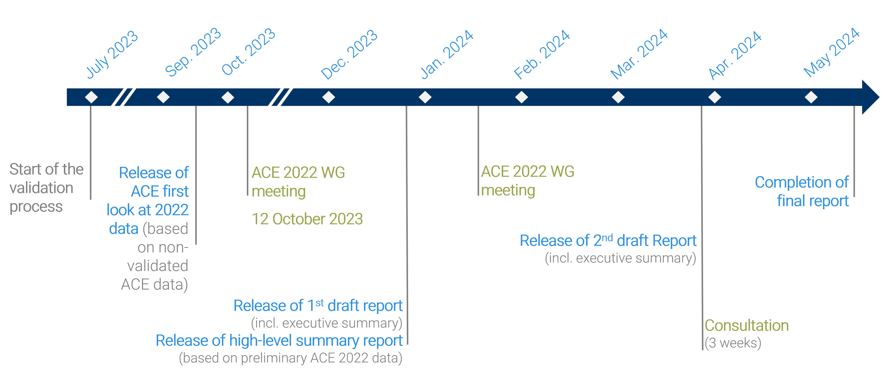

# Introduction {#Intro}

The ACE benchmarking work is commissioned by the Performance Review Commission (PRC) and carried out by the EUROCONTROL Performance Review Unit (PRU) using information provided by Air Navigation Services Providers (ANSPs) in compliance with Decision No. 88 of the Permanent Commission of EUROCONTROL on economic information disclosure.

The data processing, analysis and reporting are conducted with the assistance of the ACE Working Group, which comprises representatives from participating ANSPs, airspace users, regulatory authorities and the Performance Review Unit. This enables participants to share experiences and establish a common understanding of underlying assumptions and limitations of the data.

The objective of this document is to provide a first insight on the level of 2020 cost-effectiveness performance both for the Pan-European system and for individual ANSPs before the release of the ACE 2020 benchmarking report, which is planned end of May 2022. It also presents specific financial indicators that can be used to monitor potential cash and liquidity issues experienced by ANSPs as a result of the COVID-19 pandemic. Figure \@ref(fig:Figure-1-1) illustrates the timeline for the production of the ACE 2020 benchmarking report.

(ref:Figure-1-1) Timeline for the production of the ACE 2020 benchmarking report

```{r Figure-1-1, fig.cap = '(ref:Figure-1-1)', out.width='80%'}

```

It is important that robust ACE benchmarking analysis is available in a timely manner since several stakeholders, most notably ANSPs' management, regulatory authorities (e.g. NSAs) and airspace users, have a keen interest in receiving the information in the ACE reports as early as possible.

It should be noted that the data presented in this document are still [preliminary and not yet fully validated]{.ul}. These data reflect the information stored in the ACE database on the 11th November 2021. Figure \@ref(fig:Figure-1-2) shows the status of the ACE data validation process for the data presented in this document.

(ref:Figure-1-2) Status of 2020 data validation process

```{r Figure-1-2, fig.cap = '(ref:Figure-1-2)', out.width='80%'}
knitr::include_graphics('figures/Figure-1-2.png')
```

The data contained in this report is therefore subject to changes before the release of the final ACE 2020 benchmarking report in May 2022.

Figure \@ref(fig:Figure-1-3) below shows that 20 ANSPs provided their ACE 2020 data submission on time by the 1st July 2021 and that, in total, 26 data submissions were received by the 15th July 2021. Figure \@ref(fig:Figure-1-3) also indicates that for 11 ANSPs the ACE data submission was received more than one month after the deadline.

(ref:Figure-1-3) Status of ACE 2020 data submission

```{r Figure-1-3, fig.cap = '(ref:Figure-1-3)', out.width='80%'}
knitr::include_graphics('figures/Figure-1-3.png')

```

Clearly, the timescale for the production of the ACE benchmarking report is inevitably delayed if data are not submitted on time.

The remainder of this report is organised as follows:

-   Section \@ref(high): provides a high-level presentation of 2020 revenues, costs and staff data;
-   Section \@ref(economic): presents a preliminary analysis of economic cost-effectiveness at Pan-European and ANSP level;
-   Section \@ref(financial): presents a preliminary analysis of financial cost-effectiveness at Pan-European and ANSP level, and underlying components.
-   Section \@ref(covid): presents a preliminary analysis of specific financial indicators at Pan-European and ANSP level.
