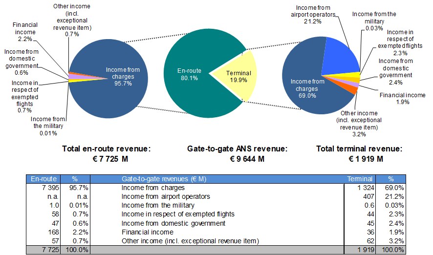
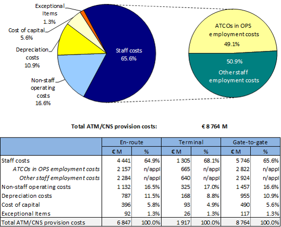
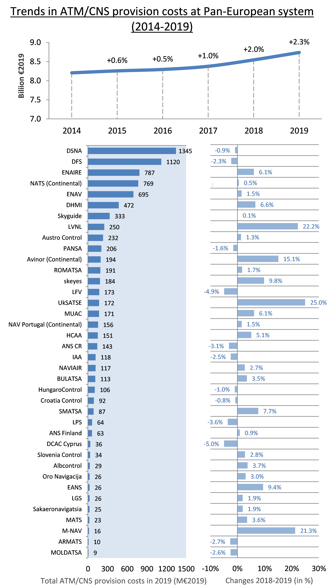
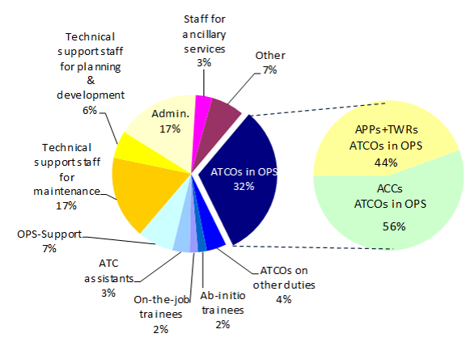
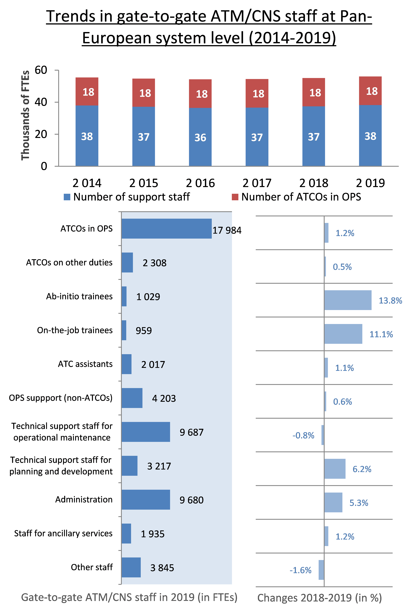

```{r read-values}
year_rev <- 2019
```

# High-level revenues, costs and staff data {#high}

This section provides a preliminary presentation of high-level revenues, costs and staff data provided in ANSPs ACE 2019 data submissions. Total ANS revenues in `r year_rev` amounted to €9 644M. Almost all en-route revenues comes from the collection of en-route charges (95.7%, see left pie chart). The proportion is lower for terminal revenues (69.0%, see right pie chart), as additional income may directly come from airport operators (21.2% e.g. through a contractual arrangement between the ANSP and the airport operator).

(ref:figure4) Breakdown of gate-to-gate ANS revenues, 2019.

```{r figure4, fig.cap = '(ref:figure4)'}

```

```{r figure41, fig.cap = '(ref:figure4)'}

chapter2_fig <- read_csv("data/fig-2-1-a.csv")

chapter2_fig <- as.data.frame(chapter2_fig)

fig <- plot_ly(chapter2_fig, type='pie', labels = chapter2_fig$A, values = chapter2_fig$B, height = 525, 
               textinfo='label+percent', textposition = 'inside',
               rotation = 120, insidetextorientation='radial', showlegend = TRUE)%>%
               layout(title = 'Gate-to-gate ANS revenue <br /> EUR 9 644 M', legend = list(orientation = 'h'), font=list(size = 7))

chapter2_fig2 <- read_csv("data/fig-2-1-b.csv")

chapter2_fig2 <- as.data.frame(chapter2_fig2, stringsAsFactors = FALSE)

chapter2_fig2$A <- factor(chapter2_fig2$A, levels = unique(chapter2_fig2$A)[order(chapter2_fig2$B, decreasing = TRUE)])

m1 <-label_number_si()(7.725e6)

fig2 <- plot_ly(chapter2_fig2, type='pie', labels = chapter2_fig2$A, values = chapter2_fig2$B, height = 525,
               textinfo='label+percent', rotation = 190, showlegend = TRUE)%>%
               layout(title = stringr::str_glue('Total en-route revenue <br /> EUR {m1}', m1 = m1), legend = list(orientation = 'h'), font=list(size = 7))

chapter2_fig3 <- read_csv("data/fig-2-1-c.csv")

chapter2_fig3 <- as.data.frame(chapter2_fig3, stringsAsFactors = FALSE)

chapter2_fig3$A <- factor(chapter2_fig3$A, levels = unique(chapter2_fig3$A)[order(chapter2_fig3$B, decreasing = TRUE)])

fig3 <- plot_ly(chapter2_fig3, type='pie', labels = chapter2_fig3$A, values = chapter2_fig3$B, height = 525, 
               textinfo='label+percent', rotation = 290,
               showlegend = TRUE) %>%
               layout(title = 'Total terminal revenue <br /> EUR 1 919 M', legend = list(orientation = 'h'), font=list(size = 7))

###

p <- plot_ly(x = rnorm(100))
browsable(div(
  style = "display: flex; flex-wrap: wrap; justify-content: center",
  div(fig2, style = "width: 33.33%; border: solid;"),
  div(fig, style = "width: 33.33%; border: solid;"),
  div(fig3, style = "width: 33.33%; border: solid;")
))


###

```

From a methodological point of view, the ACE benchmarking analysis focuses on the specific costs of providing gate-to-gate ATM/CNS services which amounted to €8 764M in 2019. Operating costs (including staff costs, non-staff operating costs and exceptional cost items) accounted for some 84% of total ATM/CNS provision costs, while depreciation costs and the cost of capital represented some 16%.

(ref:figure5) Gate-to-gate ATM/CNS provision costs at Pan-European system level, 2019.

```{r figure5, fig.cap = '(ref:figure5)', out.width='70%'}

```

In 2019, the five largest ANSPs (ENAIRE, ENAV, DFS, DSNA and NATS) bore some 54% of total Pan-European gate-to-gate ATM/CNS provision costs, while the five smallest ANSPs accounted for some 1% (see bottom left part of Figure \@ref(fig:figure6) below). Between 2014 and 2019, ATM/CNS provision costs increased continuously (+1.3% per annum, on average) at Pan-European system level (see top chart of Figure \@ref(fig:figure6)). As shown in the bottom right part of Figure \@ref(fig:figure6), the +2.3% increase in ATM/CNS costs observed for the Pan-European system in 2019 masks different trends amongst the 37 ANSPs [^high-level-revenues-costs-and-staff-data-1]. More details on the changes in ANSPs ATM/CNS provision costs in 2019 will be available in the final ACE 2019 benchmarking report [@ace_2019].

[^high-level-revenues-costs-and-staff-data-1]: Sakaeronavigatsia is excluded from the trend analysis provided in the top chart of Figure \@ref(fig:figure6) since no data is available prior to 2015 for this ANSP.

(ref:figure6) Changes in ATM/CNS provision costs, 2014-2019 (real terms).

```{r figure6, fig.cap = '(ref:figure6)', out.width='90%'}

```

The Pan-European ANSPs employed some 56 864 ATM/CNS staff in 2019 (excluding 877 internal MET staff). Some 17 984 staff (32%) were ATCOs working on operational duty, split between ACCs (56%) and APP/TWR facilities (44%). On average, 2.2 additional staff are required for every ATCO in OPS in Europe.

(ref:figure7) Breakdown of total gate-to-gate ATM/CNS staff at Pan-European system level, 2019.

```{r figure7, fig.cap = '(ref:figure7)', out.width='70%'}

```

(ref:figure8) Total gate-to-gate ATM/CNS staff per staff category and changes, 2018-2019[^high-level-revenues-costs-and-staff-data-2].

[^high-level-revenues-costs-and-staff-data-2]: Sakaeronavigatsia is excluded from the upper part of Figure \@ref(fig:figure8) since no data is available prior to 2015 for this ANSP. It is however included in the lower part of the figure as well as in the comments of changes after 2015.

::: {.cols data-latex=""}
::: {.col data-latex="{0.55\\textwidth}"}
```{r figure8, fig.cap = '(ref:figure8)', out.width='90%'}

```
:::

::: {.col data-latex="{0.05\\textwidth}"}
  <!-- an empty Div (with a white space), serving as
a column separator -->
:::

::: {.col data-latex="{0.4\\textwidth}"}
Between 2014 and 2019, the number of ATM/CNS staff employed by ANSPs increased by +0.2% p.a. (some +668 FTEs). After two years of consecutive reductions, the total staff number rose by +0.5% (+248 FTEs) in 2017, +1.0% (+554 FTEs) in 2018 and +1.9% (+1 061 FTEs) in 2019. The higher staff number observed for 2019 mainly reflects increases in the following staff categories:

-   Administrative staff (+490 FTEs, or +5.3%);
-   ATCOs in OPS (+220 FTEs, or +1.2%);
-   Technical support for planning and development (+189 FTEs, or +6.2%);
-   Ab-initio trainees (+125 FTEs, or +13.8%);
-   On-the-job trainees (+96 FTEs, or +11.1%). On the other hand, relatively small decreases are observed for support staff for operational maintenance (-77 FTEs, or -0.8%) and other staff (-63 FTEs, or - 1.6%).
:::
:::
