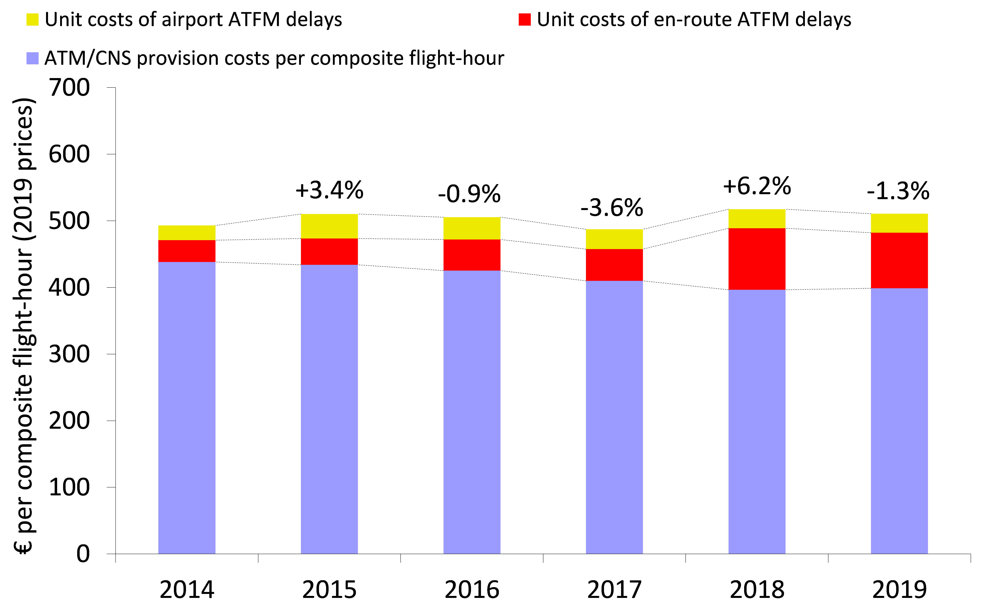
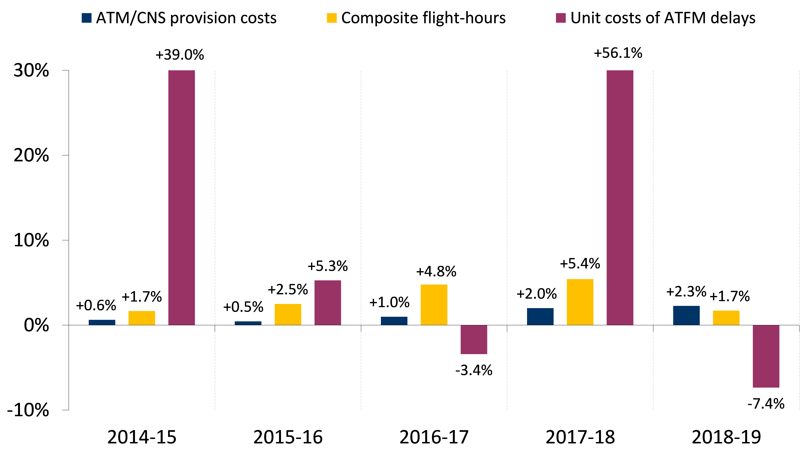
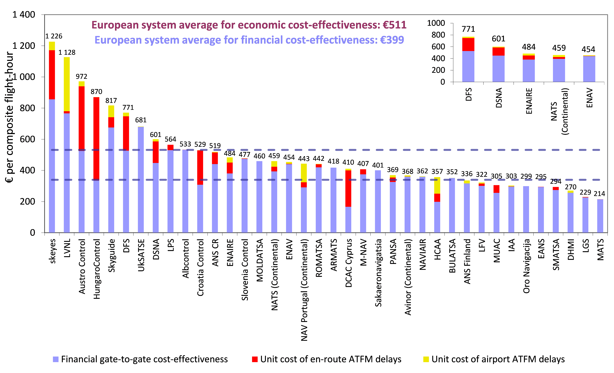

# ECONOMIC COST-EFFECTIVENESS {#economic}

This section provides a preliminary analysis of economic cost-effectiveness at Pan-European and ANSP level.

## PAN-EUROPEAN SYSTEM LEVEL

The PRC introduced in its ACE benchmarking reports the concept of economic cost-effectiveness. This indicator is defined as gate-to-gate ATM/CNS provision costs plus the costs of ground ATFM delays for both en‐route and airport, all expressed per composite flight-hour. This economic performance indicator is meant to capture trade‐offs between ATC capacity and costs^[See Annex 2 of the ACE 2018 benchmarking report for more information on the methodology used to compute composite flight-hours and economic costs.].
Figure \@ref(fig:figure9) analyses the changes in economic cost-effectiveness between 2014 and 2019 at Pan-European system level. The left-hand side of Figure \@ref(fig:figure9) shows the changes in unit economic costs, while the right-hand side provides complementary information on the year-on-year changes in ATM/CNS provision costs, composite flight-hours and unit costs of ATFM delays.

(ref:figure9) Trend of unit economic costs at Pan-European system level, 2014-2019 (real terms)^[Sakaeronavigatsia is excluded from the trend analysis provided in this section since no data is available prior to 2015 for this ANSP.].

```{r figure9, fig.cap = '(ref:figure9)', out.width='50%'}


```

Between 2014 and 2019, economic costs per composite flight-hour increased by +0.7% p.a. in real terms. Over this period, ATM/CNS provision costs increased continuously (+1.3% p.a.) in the context of a significant growth in composite flight-hours (+3.2% p.a.). At the same time, the unit costs of ATFM delays rose by +15.4% p.a., on average, over the period.
In 2019, composite flight-hours rose slower (+1.7%) than ATM/CNS provision costs (+2.3%). As a result, unit ATM/CNS provision costs increased by +0.6%. However, this increase was more than compensated by a substantial reduction in the unit costs of ATFM delays in 2019 (-7.4%) and therefore unit economic costs decreased by -1.3% compared to 2018. 

## ANSP LEVEL

The economic cost-effectiveness indicator at Pan-European level amounts to €511 per composite flight-hour, and, on average, the unit costs of ATFM delays represent some 22% of the unit economic costs.

(ref:figure10) Economic gate-to-gate cost-effectiveness^[For the purposes of the ACE benchmarking analysis, costs relating to ATM/CNS infrastructure shared with the military authority (€20.0M) are included in ENAIRE 2019 ATM/CNS provision costs. These costs, which are charged to civil airspace users, are not passing through ENAIRE Accounts from 2014 onwards but are borne by the Spanish Air Force (Ministry of Defence) as well as corresponding revenues. Without these costs, ENAIRE unit economic costs would be slightly lower and would amount to €474.], 2019.

```{r figure10, fig.cap = '(ref:figure10)'}

```


More details on the changes in ATFM delays^[The ATFM delays analysed in this ACE benchmarking report do not comprise changes due to the Post Operations Performance Adjustment Process. This process allows operational stakeholders to notify national and European authorities of issues that relate to ATFM delay measurement, classification and assignment. It is a mean of enhancing operational ATFM delay data used in the performance scheme (Commission Implementing Regulation (EU) No 390/2013). The minutes of ATFM delays resulting from this process would lead to different unit economic costs figures for some ANSPs. Detailed information on this process is available on the Network Manager website at the following link: https://www.eurocontrol.int/service/post-operations-performance-adjustment.] for individual ANSPs will be provided in the ACE 2019 benchmarking report.