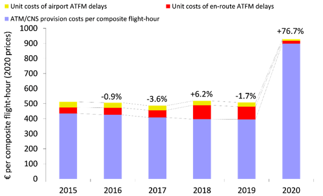
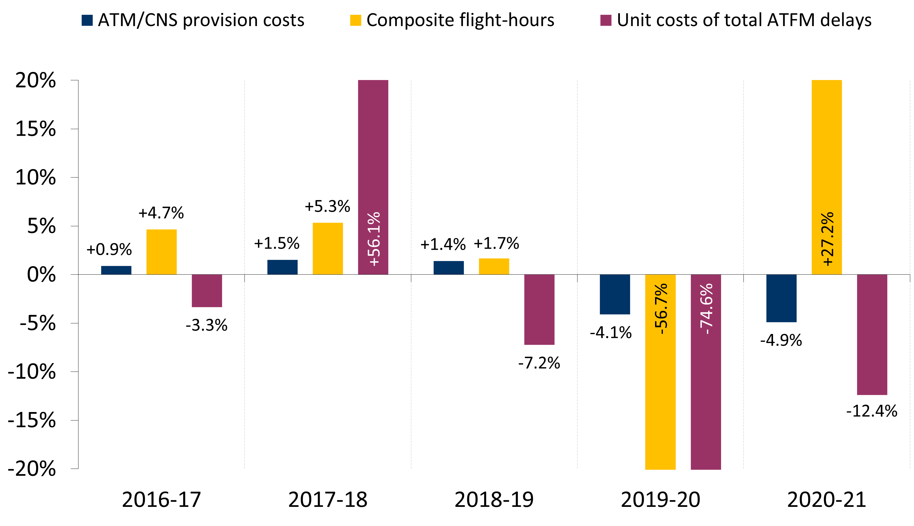
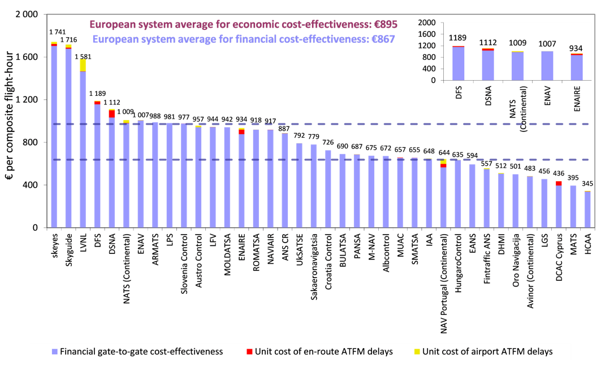

# Economic cost-effectiveness {#economic}

The PRC introduced in its ACE benchmarking reports the concept of economic cost-effectiveness. This indicator is defined as gate-to-gate ATM/CNS provision costs plus the costs of ground ATFM delays for both en‐route and airport, all expressed per composite flight-hour. This economic performance indicator is meant to capture trade‐offs between ATC capacity and costs[^economic-cost-effectiveness-1].

Figure \@ref(fig:Figure-3-1) shows preliminary results on the changes in economic cost-effectiveness between 2015 and 2020 at Pan-European system level. The left-hand side of Figure \@ref(fig:Figure-3-1) shows the changes in unit economic costs, while the right-hand side provides complementary information on the year-on-year changes in ATM/CNS provision costs, composite flight-hours and unit costs of ATFM delays.

[^economic-cost-effectiveness-1]: See Annex 2 of the ACE 2019 benchmarking report for more information on the methodology used to compute composite flight-hours and economic costs.

(ref:Figure-3-1) Trend of unit economic costs at Pan-European system level, 2015-2020 (real terms)

```{r Figure-3-1, fig.cap = '(ref:Figure-3-1)', out.width='50%'}


```

Figure \@ref(fig:Figure-3-2) shows preliminary results at ANSP level (dotted lines represent the 1st and 3rd quartiles). On average, the share of ATFM delays in 2020 was 3% (compared to 22% in 2019), and only five ANSPs had ATFM delays representing more than 5% of their unit economic costs (compared to 22 ANSPs in 2019).

(ref:Figure-3-2) Economic gate-to-gate cost-effectiveness, 2020

```{r Figure-3-2, fig.cap = '(ref:Figure-3-2)'}

```
