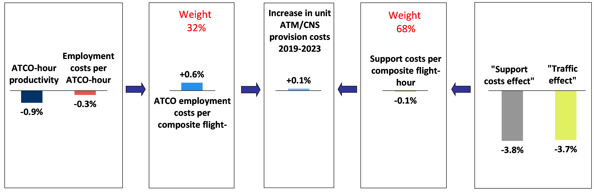

# Financial cost-effectiveness {#financial}

This section provides a preliminary analysis of financial cost-effectiveness.

## Pan-European system level {#fin_1}

Figure \@ref(fig:Figure-4-1) shows that after three years of continuous reductions and a stabilization in 2019, the unit ATM/CNS provision costs rose by +120.0% in 2020. This extraordinary increase is mainly due to the decrease in composite flight-hours (-56.8%) while ATM/CNS provision costs fell by -5.0%.

The analytical framework which is used in the ACE analysis to break down the financial cost-effectiveness indicator into basic economic drivers is presented in Figure \@ref(fig:Figure-4-2). These key drivers include:

a)   ATCO-hour productivity (0.47 composite flight-hours per ATCO-hour);
b)   ATCO employment costs per ATCO-hour (€131); and,
c)   Support costs per unit output (€589).

(ref:Figure-4-1) Changes in unit ATM/CNS provision costs, 2015-2020 (real terms)

(\#fig:Figure-4-1)(ref:Figure-4-1)

Figure \@ref(fig:Figure-4-2) shows that in 2020, ATCO employment costs per ATCO-hour rose by +12.2% while ATCO-hour productivity fell by -49.0%. As a result, ATCO employment costs per composite flight-hour increased (+120.1%).

In the meantime, unit support costs rose by +120.0% since the fall in composite flight-hours (-56.8%) was much greater than the reduction in support costs (-5.0%). As a result, in 2020 unit ATM/CNS provision costs increased by +120.0% at Pan-European system level.

(ref:Figure-4-2) ACE performance framework, 2020 (real terms)

(\#fig:Figure-4-2)(ref:Figure-4-2)

(ref:Figure-4-3) Breakdown of changes in unit ATM/CNS provision costs, 2019-2020 (real terms)

(\#fig:Figure-4-3)(ref:Figure-4-3)

## ANSP level {#fin_2}

Figure \@ref(fig:Figure-4-4) to Figure \@ref(fig:Figure-4-7) present the main ACE key performance indicators at ANSP level for the year 2020. In all these figures, the dotted lines represent the 1st and 3rd quartiles. 

There are three main elements to be considered when interpreting the level of the indicators as well as ANSPs rankings in the figures below: a) the traffic reduction in 2020, although being massive for all ANSPs, was not completely homogeneous, b) there were different responses in cost adjustments, and c) there were also different levels of flexibility in adjusting the workforce, and in particular ATCO in OPS hours on duty, which has an enormous impact on the ATCO productivity and employment costs indicators measured in the ACE report.

(ref:Figure-4-4) Financial gate-to-gate cost-effectiveness, 2020

(\#fig:Figure-4-4)(ref:Figure-4-4)

(ref:Figure-4-5) ATCO-hour productivity, 2020

(\#fig:Figure-4-5)(ref:Figure-4-5)

(ref:Figure-4-6) Employment costs per ATCO-hour, 2020

(\#fig:Figure-4-6)(ref:Figure-4-6)

(ref:Figure-4-7) Breakdown of support costs per composite flight-hour, 2020

(\#fig:Figure-4-7)(ref:Figure-4-7)

A more detailed analysis of the changes in cost-effectiveness, ATCO-hour productivity, ATCO employment costs per ATCO-hour and unit support costs will be available in the final ACE 2020 benchmarking report.
