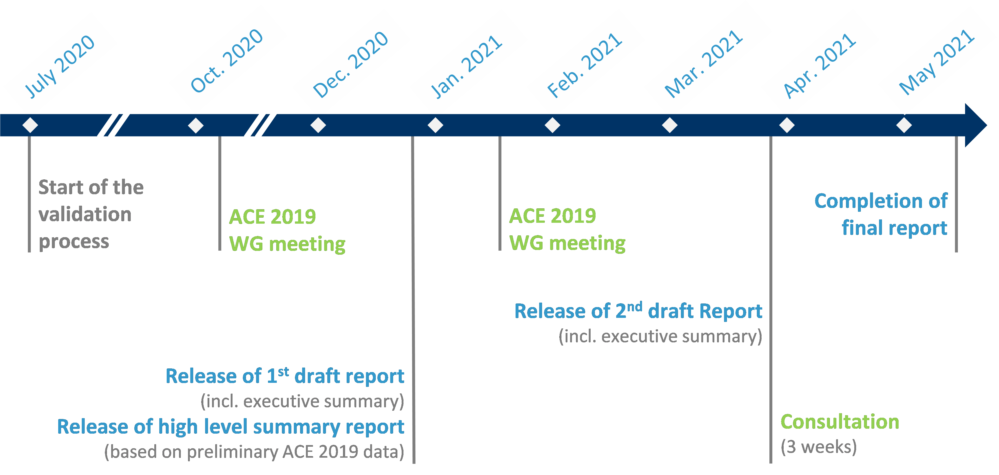
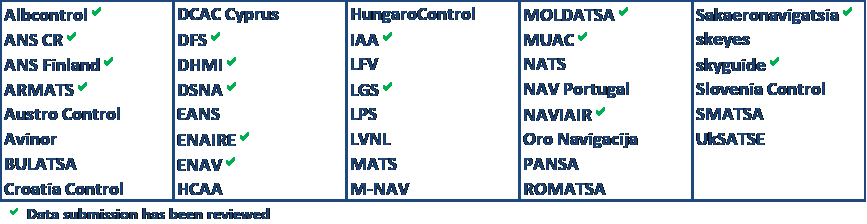
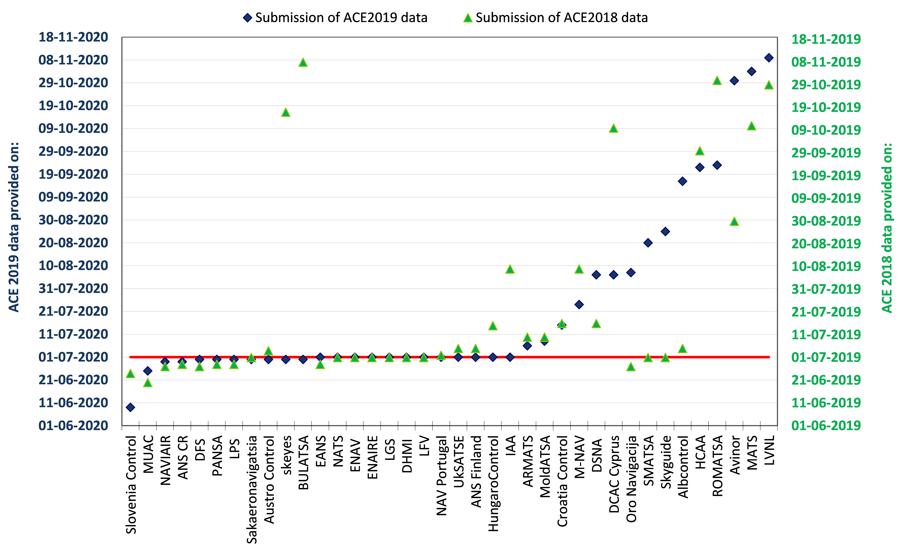

--- 
title: "HIGH-LEVEL SUMMARY REPORT ON PRELIMINARY ACE 2019 DATA"
author: "Prepared by the EUROCONTROL Performance Review Unit (PRU)"
date: December 2020
output:
  html_document:
    df_print: paged
description: Data contained in this document are preliminary and subject to changes
  before the publication of the final ACE 2019 benchmarking report in May 2021.
site: bookdown::bookdown_site
documentclass: book
bibliography:
- book.bib
- packages.bib
biblio-style: apalike
link-citations: yes
cover-image: CoverImage.PNG
---

# INTRODUCTION

The ACE benchmarking work is carried out by the Performance Review Commission (PRC) supported by the EUROCONTROL Performance Review Unit (PRU) and is based on information provided by Air Navigation Services Providers (ANSPs) in compliance with Decision No. 88 of the Permanent Commission of EUROCONTROL on economic information disclosure.
The data processing, analysis and reporting are conducted with the assistance of the ACE Working Group, which comprises representatives from participating ANSPs, airspace users, regulatory authorities and the Performance Review Unit. This enables participants to share experiences and establish a common understanding of underlying assumptions and limitations of the data.
The objective of this document is to provide a first insight on the level of 2019 cost-effectiveness performance both for the Pan-European system and for individual ANSPs before the release of the ACE 2019 benchmarking report, which is planned end of May 2021. Figure \@ref(fig:figure1) below illustrates the timeline for the production of the ACE 2019 benchmarking report.

(ref:figure1) Timeline for the production of the ACE 2019 benchmarking report.

```{r figure1, fig.cap = '(ref:figure1)'}

```

It is important that robust ACE benchmarking analysis is available in a timely manner since several stakeholders, most notably ANSPs’ management, regulatory authorities (e.g. NSAs) and airspace users, have a keen interest in receiving the information in the ACE reports as early as possible. 
It should be noted that the data presented in this document are still preliminary and not fully validated. These data reflect the information stored in the ACE database on the 13th November 2020. Figure \@ref(fig:figure2) shows the status of the ACE data validation process for the data presented in this document.

(ref:figure2) Status of 2019 data validation process.


```{r figure2, fig.cap = '(ref:figure2)'}

```
The data contained in this report is therefore subject to changes before the release of the final ACE 2019 benchmarking report in May 2021.

Figure \@ref(fig:figure3) below shows that 23 ANSPs provided their ACE 2019 data submission on time by the 1st July 2019 and that, in total, 26 data submissions were received by the 15th July 2020. Figure \@ref(fig:figure2) also indicates that for 11 ANSPs the ACE data submission was received more than one month after the deadline.

(ref:figure3) Status of ACE 2019 data submission.

```{r figure3, fig.cap = '(ref:figure3)'}


```
Clearly, the timescale for the production of the ACE benchmarking report is inevitably delayed if data are not submitted on time.
The remainder of this report is organised as follows:

* Section **\@ref(high)**: provides a high-level presentation of 2019 revenues, costs and staff data;
* Section **\@ref(economic)**: presents a preliminary analysis of economic cost-effectiveness at Pan-European and ANSP level;
* Section **\@ref(financial)**: presents a preliminary analysis of financial cost-effectiveness at Pan-European and ANSP level, and underlying components.


