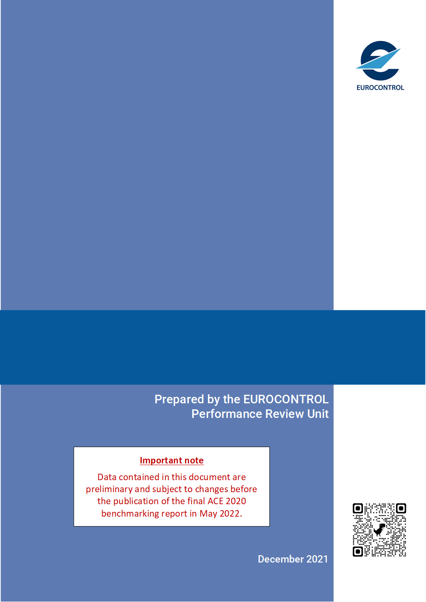

# IMPORTANT NOTICE {.unnumbered}

This is the online version of *HIGH-LEVEL SUMMARY REPORT ON PRELIMINARY ACE 2020 DATA*, a report **currently under review** and intended for release by end of May 2022.

[Data contained in this document are preliminary and subject to changes before the publication of the final ACE 2020 benchmarking report in May 2022.]{style="color: red;"}

